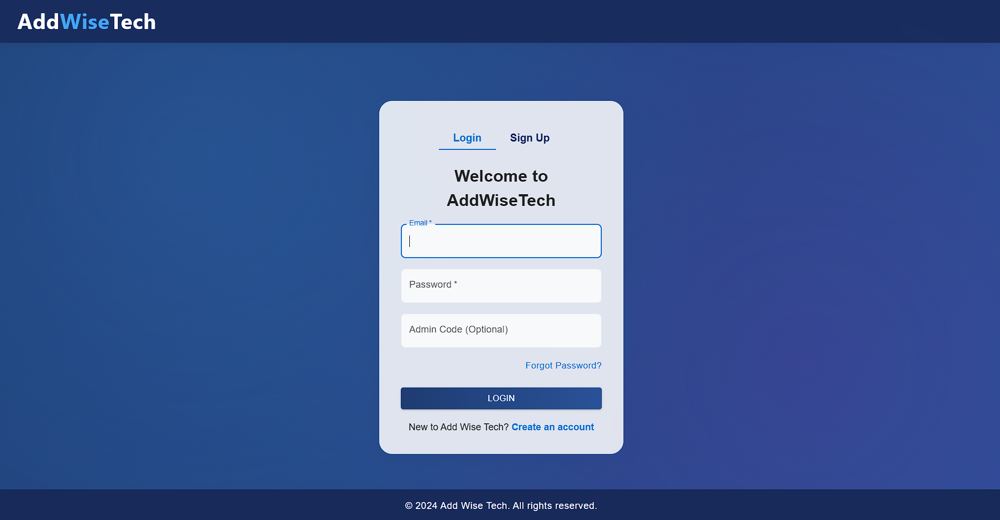
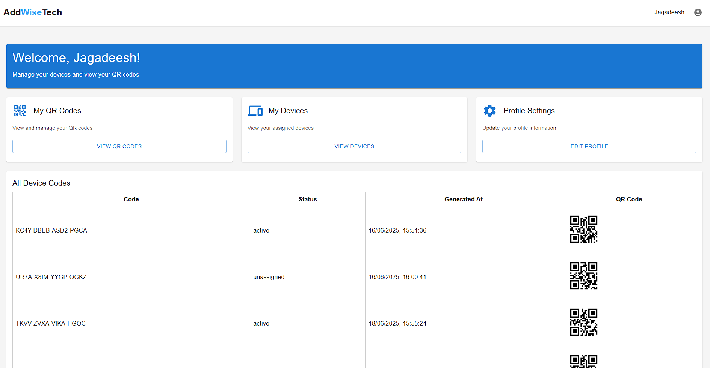
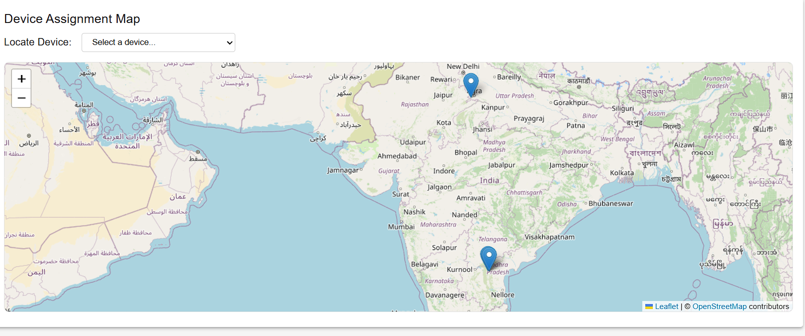
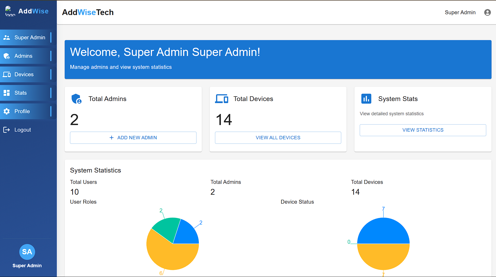
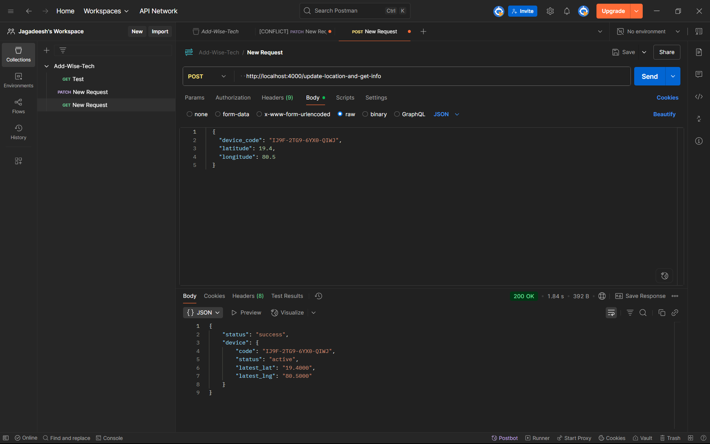

# Gps-Tracker-add-wise-tech

## Overview

Gps-Tracker-add-wise-tech is a full-stack IoT web application for real-time device tracking, assignment, and management. It supports role-based dashboards (User, Admin, Super Admin), device assignment via QR code, live location updates, and path visualization on a map. The backend uses Supabase for authentication and data storage, and a custom Express API for device location updates. The frontend is built with React, Material-UI, and Leaflet for interactive maps.

---

## Features

- **User Authentication** (Supabase)
- **Role-Based Dashboards**: User, Admin, Super Admin
- **Device Assignment**: Assign devices to users via QR code scan
- **Real-Time Location Tracking**: Update and fetch device locations
- **Path Visualization**: Show device movement history and total distance on a map
- **Admin Tools**: Generate device codes, assign users, view all devices
- **Super Admin Tools**: Full system access and management
- **Custom API**: For secure device location updates and info retrieval
- **Postman-Ready**: Test all API endpoints easily

---

## Tech Stack

- **Frontend**: React, Material-UI, Leaflet
- **Backend**: Node.js, Express, Supabase
- **Database**: Supabase Postgres
- **Other**: QR code generation, Postman for API testing

---

## Setup Instructions

1. **Clone the repository**
   ```sh
   git clone https://github.com/JagadeeshChandra12/Gps-Tracker-add-wise-tech.git
   cd AddWise
   ```
2. **Install dependencies**
   ```sh
   npm install
   ```
3. **Start the application**
   ```sh
   npm start
   ```
   - This will start both the React frontend and the Express backend.
4. **Configure Supabase**
   - Add your Supabase project URL and service role key in the backend API file if needed.

---

## Usage

- **User Flow**: Log in, scan QR to assign device, view device and path on map, see total distance.
- **Admin Flow**: Generate device codes, assign devices to users, view/manage all devices.
- **Super Admin Flow**: Full access to all features and data.
- **API Testing**: Use Postman to GET/POST device locations and see changes reflected on the map.

---

## API Endpoints

### Device Location
- `GET /get-location?device_code=...` — Get current lat/lng for a device
- `GET /get-locations?device_code=...` — Get all locations (with timestamps) for a device
- `POST /update-location` — Update device location (add a new point)
  - Body: `{ "device_code": "...", "latitude": ..., "longitude": ... }`
- `POST /update-location-and-get-info` — Update location and get latest info in one call

### Device Assignment
- Handled via frontend (QR scan) and admin dashboard

---

## Screenshots

### Login Page


### User Dashboard


### Device Map


### Super Admin Dashboard


### Postman API Test


---

## License

This project is for educational and demonstration purposes.

---

**Made by Jagadeesh** 
